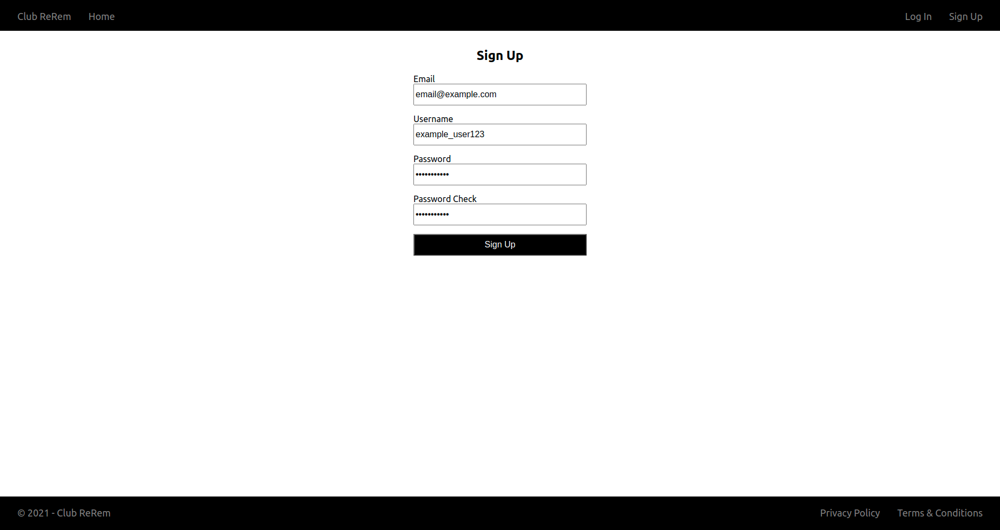

# clubrerem
A club on the edge of the internet.

## About
This project is a social platform that will be built under the look and feel of a nightclub.
[Trello](https://trello.com/b/L4cNPRYd/club-rerem)

## Running
This project uses Docker, you will need Docker installed to properly run and work with this project.

You will need to CD into both the frontend and backend directories and run *npm install* to 
ensure the development tools are properly installed.

*Note*: If you're using Windows, run Docker with WSL2 and clone the repository inside a WSL2 distro and
not on your Windows filesystem as Windows is buggy with Docker.

To run, you should type *docker-compose up*.
To build, you should type *docker-compose up -d --build*.

## Unit Tests
To run the unit tests, you should type *npm test*. Unit tests are located in the src/tests folder and named *name*.test.js where *name*
would be a name for the test.

## Contributing
This project is intended as a solo project for now, but if you want to commit feel free to contact me or send an issue.
